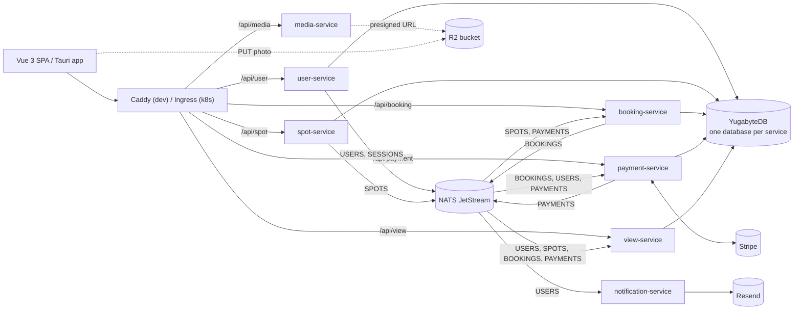

# OurDriveway (WIP)

**Rent out your driveway.** OurDriveway is a marketplace for private parking: a host lists
their driveway with the hours it is free, and a renter finds it on a map, books a slot and
pays for it. Once the booking is over and has settled, the host can withdraw the money.

> [!NOTE]
> **This is a portfolio project, and a work in progress.** It is not a live product and
> is not meant to become one. It exists to explore how to build a fast, horizontally
> scalable backend properly. The core flow works end to end — sign up, list a spot, find
> it on a map, book it, pay with Stripe (in test mode), cancel, get refunded, withdraw
> earnings — but the architecture is still moving. See
> [Status and known gaps](#status-and-known-gaps).

---

## Showcase

A walkthrough of the running app, recorded on the Android build — the same Vue frontend
the web app uses, wrapped in the Tauri shell, against the real services.

Watch it as a **work in progress**: it shows the core flow working end to end, not a
finished product — see [Status and known gaps](#status-and-known-gaps). The frontend is
also a **development build** on both sides, `npm run tauri android dev` — the web layer
from the Vite dev server, the native Tauri shell a debug `cargo` build — so it runs
slower in the video than a release build would.

<!-- To replace the video: drag the .mp4 into a comment box on a GitHub issue, wait for
     the upload, and paste the https://github.com/user-attachments/assets/… URL it gives
     back on its own line below — GitHub renders an inline player only for that kind of
     URL, and it has to be its own paragraph. Keep the file under 10 MB, which is the
     attachment ceiling for video; the one below is 540×1200, CRF 27, ~7.4 MB. -->

https://github.com/user-attachments/assets/8c8c9894-14c5-4362-84c5-5c076cd748a3

---

## Contents

- [Showcase](#showcase)
- [Background: why this is a rewrite](#background-why-this-is-a-rewrite)
- [What the app does](#what-the-app-does)
- [Tech stack](#tech-stack)
- [Architecture at a glance](#architecture-at-a-glance)
- [The services](#the-services)
- [The ideas the backend is built on](#the-ideas-the-backend-is-built-on)
  - [Microservices, one database each](#microservices-one-database-each)
  - [Events on NATS JetStream](#events-on-nats-jetstream)
  - [The transactional outbox](#the-transactional-outbox)
  - [CQRS: writes in the owner, reads in view-service](#cqrs-writes-in-the-owner-reads-in-view-service)
  - [Read-your-own-writes](#read-your-own-writes)
  - [Three kinds of event loop](#three-kinds-of-event-loop)
  - [Concurrency without double bookings](#concurrency-without-double-bookings)
  - [Request/reply, used sparingly](#requestreply-used-sparingly)
- [A booking, end to end](#a-booking-end-to-end)
- [Inside a service](#inside-a-service)
- [Repository layout](#repository-layout)
- [Running it locally](#running-it-locally)
- [Tests](#tests)
- [Deploying](#deploying)
- [How it scales](#how-it-scales)
- [Status and known gaps](#status-and-known-gaps)
- [Things to do](#things-to-do)

---

## Background: why this is a rewrite

OurDriveway started as a **school project**, built in **React Native with Expo on top of
Firebase**. Firebase made it quick to get something on screen, but everything important
lived inside it: auth, the data, the rules deciding who could read what, and the ceiling
on how far and how cheaply it could grow.

I decided to rewrite it from scratch with two goals:

1. **No dependency on Firebase or any other backend-as-a-service.** Every piece is either
   code in this repository or a piece of infrastructure that can run anywhere — a laptop,
   a single VPS, or a Kubernetes cluster. The only outside services left are the ones
   that genuinely have to be: Stripe for money, Resend for email, LocationIQ for address
   lookup, and an S3-compatible bucket (Cloudflare R2) for photos.
2. **A very fast backend that scales well.** The services are written in **Rust** on
   **axum** and **tokio**. They are stateless, so scaling out means running more copies.
   The storage is **YugabyteDB**, a distributed, PostgreSQL-compatible SQL database that
   scales horizontally. The services talk to each other through events on **NATS
   JetStream** rather than by calling each other, so one slow or failing service does not
   take the others down with it.

The frontend was rewritten too: **Vue 3 + TypeScript**, shipped as a web app and wrapped
with **Tauri 2** for native builds (including Android).

The rewrite has been through a few foundations of its own:

1. **A private SurrealDB per service instance.** At first, the event log was the source
   of truth. Every running instance kept its own copy of all the data it needed, replayed
   from the log into a SurrealDB instance next to it. I quickly found that this was not
   future-proof. Every replica meant another full copy of the data, a cold start meant
   replaying the whole history, and the log could never be allowed to expire.
2. **SurrealDB over TiKV.** The next step was a shared, distributed store, with the
   services writing their own rows and events flowing through an outbox.
3. **YugabyteDB.** One process in place of SurrealDB, TiKV and its placement driver,
   with real SQL, Read Committed transactions and PostgreSQL compatibility. sqlx was then
   replaced with diesel, so queries are checked against the schema at compile time.

Most of the long comments in the code are notes from those moves, explaining why things
are shaped the way they are.

## What the app does

**As a host**

- List a driveway: title, description, photos, hourly price, address, and a weekly
  availability grid. The address is re-geocoded on the server, and the spot's timezone is
  worked out from its coordinates.
- Pause a listing with a live switch, edit it, or delete it. Deleting cancels and refunds
  every booking the spot still has.
- See who has booked each spot and when.
- Onboard to Stripe Connect with Stripe's embedded components. A **wallet** shows money in
  and out month by month, and earnings can be withdrawn to a bank account once each
  booking has settled.

**As a renter**

- Find spots on a map (MapLibre), search addresses with type-ahead, and filter by day and
  time.
- Book one or more 30-minute slots. A booking holds its slots for 15 minutes while you
  pay, then confirms when Stripe says the money arrived.
- Cancel a confirmed booking up to an hour before it starts and get a refund.
- See your upcoming and past bookings, and the next one up on the home screen.

**As anyone**

- Sign up, verify your email address through a mailed link, and log in. Sessions are
  short-lived JWTs plus a rotating refresh token in an httponly cookie.
- Edit your profile: name, picture, licence plates, and the country Stripe needs for
  payouts.

## Tech stack

| Layer      | Choice                                                                                                     |
| ---------- | ---------------------------------------------------------------------------------------------------------- |
| Services   | Rust (edition 2024), axum 0.8, tokio                                                                       |
| Database   | YugabyteDB 2026.1 (YSQL, PostgreSQL wire protocol), diesel + diesel-async                                  |
| Event log  | NATS JetStream                                                                                             |
| Validation | garde, through one shared extractor                                                                        |
| Auth       | JWT access tokens, rotating refresh tokens, argon2 password hashes                                         |
| Payments   | Stripe Checkout Sessions (Payment Element), Stripe Connect for payouts                                     |
| Email      | Resend                                                                                                     |
| Media      | Presigned PUTs straight from the browser to Cloudflare R2                                                  |
| Geo        | LocationIQ (autocomplete + geocoding), tzf-rs for the timezone of a point                                  |
| Frontend   | Vue 3, TypeScript, Vite, Tailwind 4, shadcn-vue / reka-ui, TanStack Query, vee-validate + zod, MapLibre GL |
| Native     | Tauri 2 (desktop and Android)                                                                              |
| Edge       | Caddy in dev; Traefik ingress on Kubernetes in production                                                  |
| Deployment | Docker images built with `docker buildx bake`, deployed with a Helm chart                                  |

## Architecture at a glance



The short version:

- **Every write goes to the service that owns the data.** That service validates it,
  writes its own rows and records an event, all in one database transaction.
- **Every read goes to view-service.** It keeps a read model built from everyone's events
  and shaped around what the screens need.
- **Services don't call each other to get work done.** They react to each other's
  events. The one exception is a best-effort lookup, covered under
  [Request/reply](#requestreply-used-sparingly).

## The services

| Service                  | Port (dev)  | Owns                                                             | Publishes           | Consumes                                                                     |
| ------------------------ | ----------- | ---------------------------------------------------------------- | ------------------- | ---------------------------------------------------------------------------- |
| **user-service**         | 3000        | accounts, passwords, email verification, sessions                | `USERS`, `SESSIONS` | —                                                                            |
| **booking-service**      | 3001        | bookings, holds, cancellations                                   | `BOOKINGS`          | `SPOTS` (a mirror of what can be booked), `PAYMENTS` (confirms bookings)     |
| **spot-service**         | 3002        | listings, availability, geocoding                                | `SPOTS`             | — (answers one RPC: a spot's card)                                           |
| **view-service**         | 3003        | the read model every screen reads                                | —                   | `USERS`, `SPOTS`, `BOOKINGS`, `PAYMENTS`                                     |
| **media-service**        | 3004        | nothing — mints presigned upload URLs                            | —                   | —                                                                            |
| **notification-service** | health only | nothing — sends email                                            | —                   | `USERS` (verification mail)                                                  |
| **payment-service**      | 3006        | payments, refunds, payouts, Stripe Connect accounts, the webhook | `PAYMENTS`          | `BOOKINGS`, `USERS` (mirrors), `BOOKINGS` + `PAYMENTS` (settlement, payouts) |

Two background loops are worth knowing about. booking-service runs a **sweeper** that
releases holds nobody paid for. payment-service runs **settlement and payout workers**,
which decide refunds and make the actual Stripe transfers.

## The ideas the backend is built on

### Microservices, one database each

Each service owns a **separate database** in the YugabyteDB cluster (`user`, `spot`,
`booking`, `payment`, `view`), and no service reads another's. What a service needs from
elsewhere, it keeps a **mirror** of, built from events. booking-service keeps just enough of
each spot to decide whether a slot is free. payment-service keeps the bookings it charges
for and the email and country Stripe needs from a user.

That costs some duplicated data, and in return:

- a service can be deployed, scaled, migrated or restarted without the others noticing;
- a slow or down service does not slow down or break the requests of another;
- each schema changes on its own schedule, through its own migrations in `migrations/<db>/`.

Schema is applied by a single **migrator** (`apps/migrator`), never by the services
themselves. In dev it is `scripts/migrate.sh`; in Kubernetes it is a Helm hook Job.
`diesel_migrations` takes no lock, so letting every replica migrate at boot would race.

### Events on NATS JetStream

There is **one stream per bounded context** — `USERS`, `SESSIONS`, `SPOTS`, `BOOKINGS`,
`PAYMENTS`. Each keeps seven days of events, except `SESSIONS`, which keeps 31 — as long
as a refresh token lives. Every event travels in a shared **envelope**
(`shared/src/events/`) carrying an event id, the actor, when it happened, the aggregate
it belongs to, and that aggregate's **version**.

Subjects follow one grammar, `<domain>.<entity>.<id>`. The key a subject is built from
decides what shares an ordering: bookings are keyed on their **spot**, payments on their
**booking**, payouts on their **host**. That is what keeps, for example, every booking on
one spot in order relative to each other.

Each stream is split into **16 partitions** (`shared::events::PARTITIONS`). NATS assigns
the partition from the subject as it stores the message, and each projector runs one
durable consumer per partition, with one message in flight at a time. The result is
strict order per key, parallelism across keys, and no partition assignment or rebalancing
code anywhere.

Delivery is **at-least-once**. Publishes carry `Nats-Msg-Id`, so a retry inside the
stream's duplicate window is dropped by the server. Anything outside that window is
absorbed by the consumers, because every projection is an idempotent upsert and every
side effect carries an idempotency key.

### The transactional outbox

The hard part of "write to the database, then publish an event" is the gap between the
two. A crash after the commit but before the publish loses the event, and the rest of the
system never hears about the change.

So nothing publishes directly. A service writes its rows **and** an `_outbox` row in the
**same transaction**, and a relay (`bus/src/outbox.rs`) moves outbox rows to NATS
afterwards. Either both the data and the event exist, or neither does.

Only **one relay per service** runs at a time, chosen by a lease in the database
(`bus/src/lease.rs`) that expires on the database's clock rather than any replica's. Two
relays interleaving could publish one booking's `reserved → confirmed → cancelled` out of
order, so the lease is load-bearing, not an optimisation.

### CQRS: writes in the owner, reads in view-service

The system separates the **command side** from the **query side**:

- **Commands** (`POST`, `PATCH`, `DELETE`) go to the service that owns the data. It
  validates, applies its rules, writes, and answers **`202 Accepted`**. The event is in the
  log, but the read side has not necessarily caught up yet. The exceptions answer `200`
  because their result is usable immediately: login and refresh (the token), and
  starting a checkout (the Stripe session).
- **Queries** (`GET /api/view/...`) go to view-service, which projects all four domain
  streams into tables shaped for reading. One statement answers a screen, instead of a
  fan-out across services.

Its routes live in four namespaces, and the namespace **is** the authorization rule:

| Namespace             | Who may read         |
| --------------------- | -------------------- |
| `/api/view/public/…`  | any signed-in user   |
| `/api/view/host/…`    | `host_id = caller`   |
| `/api/view/renter/…`  | `renter_id = caller` |
| `/api/view/account/…` | `id = caller`        |

The caller always comes from the verified JWT, never from a path or query parameter.
Something you may not see answers **404, not 403**, so its existence is not confirmed.

On both sides, **what goes over the wire is its own type.** A request is
`XRequest`/`XQuery` and its answer is `XResponse`. They live in `shared/src/requests` and
`shared/src/responses`, except view-service's two query-string structs, which sit beside
their handlers. Projections, the columns a statement selects, never cross the wire
directly, so adding a column to a read cannot silently leak a field to the client.

### Read-your-own-writes

The price of CQRS is lag: you create a spot, the list reloads, and it isn't there yet.
The fix is keyed on the **aggregate**, not the whole log:

1. Every write answers with an **`X-Version`** header naming the aggregate and the version
   it reached, e.g. `spot:019f…@3`.
2. The frontend remembers the newest version per aggregate (`src/lib/awaitVersion.ts`) and
   sends them all back on every request as **`X-Await-Version`**.
3. A middleware layer in every service with a database (`bus/src/await_version.rs`) holds the request until
   its projection has reached those versions, capped at two seconds.

It waits for _one row_, not for every event in a stream, so other people's writes never
slow your reads down.

### Three kinds of event loop

Background work comes in exactly three shapes, and each has its generic half in `bus`:

| Loop                           | Driven by             | Does                                                                  | Example                                                           |
| ------------------------------ | --------------------- | --------------------------------------------------------------------- | ----------------------------------------------------------------- |
| **Projector** (`projector.rs`) | a stream, partitioned | applies events to this service's tables — idempotent, ordered per key | view-service building the read model                              |
| **Worker** (`worker.rs`)       | a stream consumer     | performs a side effect once per event                                 | send a verification email, issue a refund, make a payout transfer |
| **Sweeper** (`sweeper.rs`)     | a timer               | reacts to time passing                                                | release booking holds whose 15 minutes are up                     |

Workers make decisions from **current state**, not from which event woke them. The
settlement rule is one function, reached from either direction: "a booking ended before
its payment resolved" and "a payment resolved after its booking ended" land in the same
place.

### Concurrency without double bookings

Two renters racing for the same slot is the problem that decides the design of the
booking path. Here is how it is handled:

- booking-service takes a **`SELECT … FOR UPDATE`** lock on its mirror row of the spot as
  the **first** statement of the reserve transaction.
- YugabyteDB runs in **Read Committed**, so once the loser gets the lock, its next statement
  sees a **fresh snapshot** that includes the winner's booking. The availability check
  then refuses the slot by name, and the renter gets a clean **409** rather than a retry
  loop.
- This depends on a real property of the database version: YugabyteDB **≥ 2025.2**
  started through `yugabyted`. On older versions Read Committed silently degrades to
  Snapshot and the same code double-books with no error anywhere. The measurements are in
  `docker/docker-compose-dev.yml`.
- Every aggregate carries a **version** that is bumped inside the transaction that changes
  it. It is what a client waits on, and what lets a projector spot and ignore an event
  that arrives out of order.
- Withdrawals are serialized on a Postgres **advisory lock** per host, with the balance
  computed _inside_ the lock. Two double-clicked withdrawals cannot both spend the same
  money, and the amount actually paid is the one reported back.

### Request/reply, used sparingly

There is a third way data crosses a service boundary: NATS request/reply
(`bus/src/service.rs`, `shared/src/rpc`). It is for a single value you need **right now**,
keyed by an id you already hold — payment-service asking spot-service for a spot's title
to label a checkout.

It is **best-effort by design**. A request couples the caller's availability to the
responder's, which is exactly what the event log exists to avoid. So nothing load-bearing
travels this way: no amounts, no authorization, nothing a decision depends on. If the
answer not arriving would break something, it belongs in an event instead.

## A booking, end to end

1. **Reserve.** The renter picks slots and the client sends `POST /api/booking`.
   booking-service locks the spot, checks the slots against the availability and existing
   bookings, prices the booking, and writes a `reserved` row plus a `BookingCreated`
   outbox row in one transaction. It answers `202` with the new booking's id and an
   `X-Version`.
2. **Relay.** The outbox relay publishes the event to `BOOKINGS`. view-service projects it,
   so the slot shows as taken to everyone. payment-service projects it into its own
   mirror of the booking.
3. **Checkout.** The client sends `POST /api/payment/session`. payment-service creates a
   Stripe Checkout Session for the amount booking-service priced; the client never sends
   an amount. The renter pays in Stripe's Payment Element.
4. **Confirm.** Stripe calls `/api/payment/webhook`, the one route without a JWT; it
   authenticates by signature. payment-service records the payment and publishes
   `PAYMENTS`. booking-service's worker picks that up and moves the booking to
   `confirmed`.
5. **Or not.** If nobody pays within 15 minutes, booking-service's sweeper releases the
   hold, and a renter who backs out can release it immediately. A confirmed booking can
   be cancelled up to an hour before it starts. payment-service's settlement worker sees
   the terminal booking event and issues the refund.
6. **Settle and withdraw.** Once a booking has been over for the settlement window, its
   income becomes available in the host's wallet. A withdrawal creates a `requested`
   payout row. A worker then makes the Stripe Connect transfer and moves the row to `paid`
   or `failed`.

Every step after the first is asynchronous and survives a restart of any service in
between. The events wait in the stream, and the rows wait in the outbox.

## Inside a service

Every service has the same layers, and what decides where code goes is **what it holds**:

```
apps/services/<name>/src/
  main.rs          wiring, config, spawning the loops
  route/           HTTP shape only: extract, call one service method, build the response
  service/         holds the I/O handles (db, clients) and writes + enqueues events
  client/          the only place a third-party SDK is named (Stripe, LocationIQ, Resend)
  policy/          pure functions: no I/O, no clock, no state — and unit-tested without a database
  repository/      one file per table, diesel DSL against generated schema modules
  projector.rs     applies a stream to this service's tables
  worker.rs        reacts to a stream with side effects
  sweeper.rs       the clock-driven loop, where there is one
```

Some rules that hold everywhere:

- **Handlers spell out exactly what they return.** No `impl IntoResponse`: a write is
  `(StatusCode, [(HeaderName, String); 1])`, a read is `Json<SomeResponse>`.
- **Validation lives in `shared/src/requests`**, not in the services, through `garde` and
  one extractor. A service never hand-rolls a 422, and field errors come back keyed with
  the same camelCase names the frontend forms use.
- **`shared` stays runtime-free.** It is plain data: models, events, requests, responses,
  validation. Anything that needs tokio or NATS lives in **`bus`**.
- **Queries are type-checked against the real schema.** diesel's schema modules are
  generated from the live database (`scripts/print-schema.sh`), so a column that moves is
  a compile error at the query, not an error in production.

## Repository layout

```
apps/
  services/          the seven Rust services
  migrator/          the one process that applies schema to all five databases
  frontend/          Vue 3 app; src-tauri/ is the native shell (its own Cargo workspace)
bus/                 NATS plumbing: outbox relay, projector, worker, lease, await-version, rpc
shared/              runtime-free types: events, domain models, requests, responses, schema
migrations/<db>/     SQL migrations per database (user, spot, booking, payment, view)
docker/              dev compose file (YugabyteDB, NATS, Caddy, Stripe CLI) and Caddyfile
k8s/                 Helm chart, values per environment, deploy script — see k8s/README.md
scripts/             migrate.sh, print-schema.sh
docker-bake.hcl      builds every image
```

## Running it locally

In dev, only the infrastructure runs in Docker. The Rust services run natively on the
host, which keeps the edit-compile-run loop fast.

**Prerequisites:** Rust (edition 2024), Node.js, Docker. For payments, a Stripe sandbox;
for email, a Resend key (or notifications switched off); for address search, a LocationIQ
key; for photos, an R2 or other S3-compatible bucket.

**1. Start the infrastructure**

```sh
docker compose -f docker/docker-compose-dev.yml up -d nats yugabyte
```

YSQL listens on **5433** (not 5432), and the YugabyteDB UI is on http://localhost:15433.
Add `caddy` to serve a built frontend on :80, and `stripe-cli` to forward webhooks to
payment-service (see below).

**2. Create and migrate the databases**

```sh
scripts/migrate.sh
```

This is the only thing that touches schema in dev. A service started against an
unmigrated database fails fast, on purpose.

**3. Configure the services**

Each service reads `apps/services/<name>/.env`, relative to the **repository root**, so
run the binaries from there. Nothing has a default: a missing variable stops the service
at boot and names the variable. The full list per service is the `CONFIG` block at the
top of its `main.rs`. Roughly:

| Service                            | Needs                                                                                                                                                                |
| ---------------------------------- | -------------------------------------------------------------------------------------------------------------------------------------------------------------------- |
| every service                      | `PORT`                                                                                                                                                               |
| all but notification-service       | `JWT_SECRET`                                                                                                                                                         |
| all but media-service              | `NATS_URL`                                                                                                                                                           |
| user, spot, booking, payment, view | `DATABASE_URL` (e.g. `postgres://yugabyte@127.0.0.1:5433/booking`)                                                                                                   |
| user-service                       | `JWT_EXPIRATION`, `REFRESH_TOKEN_EXPIRATION`, `EMAIL_TOKEN_SECRET`, `MEDIA_BASE`                                                                                     |
| spot-service                       | `LOCATIONIQ_API_KEY`, `MEDIA_BASE`                                                                                                                                   |
| payment-service                    | `STRIPE_SECRET_KEY`, `STRIPE_WEBHOOK_SECRET`, `SETTLEMENT_SECS`                                                                                                      |
| view-service                       | `SETTLEMENT_SECS`                                                                                                                                                    |
| media-service                      | `S3_ENDPOINT`, `S3_REGION`, `S3_BUCKET`, `S3_ACCESS_KEY_ID`, `S3_SECRET_ACCESS_KEY`, `MEDIA_BASE`, `PRESIGN_EXPIRY_SECS`, `MAX_UPLOAD_BYTES`                         |
| notification-service               | `NOTIFICATIONS_ENABLED`, `RESEND_API_KEY`, `MAIL_FROM`, `APP_BASE_URL`, `COMPANY_NAME`, `EMAIL_TOKEN_SECRET`, `VERIFY_TOKEN_TTL_SECS`, `TEMPLATE_EMAIL_VERIFICATION` |

`JWT_SECRET` must be the same everywhere, and so must `EMAIL_TOKEN_SECRET` between
user-service and notification-service.

**4. Build and run**

```sh
cargo build --workspace
./target/debug/user-service &     # and so on for each service
```

Optional test data (two users and a spot):

```sh
cargo build --workspace --all-targets && ./target/debug/examples/seed
```

**5. Run the frontend**

```sh
cd apps/frontend
npm install
npm run dev              # http://localhost:1420, /api proxied to the services
```

Or run `npm run build` and let the `caddy` container serve `dist/` on http://localhost,
which is closer to production and reachable from a phone on the same network.

For a native build: `npm run tauri dev`, or `npm run tauri android dev` for Android.

**6. Stripe webhooks (optional)**

Put `STRIPE_SECRET_KEY` in `docker/.env` (copy `docker/.env.example`), start the
`stripe-cli` container, then read the signing secret from its logs:

```sh
docker compose -f docker/docker-compose-dev.yml logs stripe-cli | grep -i whsec
```

and set it as `STRIPE_WEBHOOK_SECRET` for payment-service before starting it.

## Tests

```sh
cargo test --workspace                      # unit tests: no database, no NATS
docker compose -f docker/docker-compose-dev.yml up -d yugabyte
cargo test --workspace -- --ignored         # database tests; they migrate themselves
```

Most of the logic that matters — availability, pricing, cancel deadlines, settlement,
payout limits, the wallet fold, the geo bounding box, validation — is in `policy/`
modules and `shared/src/requests`, and is tested there with no infrastructure at all.
CI (`.github/workflows/ci.yml`) runs `cargo test --workspace` and a frontend build, and
publishes images to GHCR from `main`.

`CLAUDE.md` has more on build flags, measured build times and conventions.

## Deploying

### Branches

**`main` is the production branch.** `dev` is where work lands first and reaches `main`
through a pull request; nothing is committed to `main` directly.

Both paths run [`.github/workflows/ci.yml`](.github/workflows/ci.yml), but they stop at
different points. A pull request runs `cargo test --workspace` and the frontend's
`vue-tsc --noEmit && vite build`, and that is all — nothing is published for code that was
never merged. A push to `main` runs the same tests and then, only if they pass, builds all
nine images with `docker buildx bake`, pushes them to `ghcr.io` tagged with the commit sha,
and moves `:latest` onto them once every image is up, so a partial failure leaves the
previous release serving. Older tags are pruned to roughly twenty pushes of rollback depth.

What that automates is **publishing, not deployment**: a green `main` means the images for
that commit exist in the registry. Rolling the cluster onto them is still a deliberate
`k8s/deploy.sh prod`.

### The cluster

Production is **Kubernetes with plain Helm**: one chart, `values-local.yaml` for a k3d
cluster and `values-prod.yaml` for a VPS behind Cloudflare.

```sh
docker buildx bake              # build every image
k8s/deploy.sh local             # or: k8s/deploy.sh prod
```

- Each backend is a data entry in `values.yaml`, rendered by one template, with
  `/readyz` readiness probes and a ClusterIP Service in front of its pods.
- The Ingress routes `/api/<service>` to each service and everything else to the frontend,
  on **one origin**. That is what keeps the `SameSite=Strict` refresh cookie working and
  CORS unnecessary.
- The migrator runs as a Helm hook Job, after the first install and before every
  upgrade. No service Deployment touches schema.
- `/internal/backfill` on each writing service re-emits its current state, so a
  projection can be rebuilt. It is outside `/api` and therefore unreachable from outside
  the cluster.

[`k8s/README.md`](k8s/README.md) covers TLS, a local k3d cluster, what load-balances what,
where state lives, and rebuilding projections in detail.

## How it scales

- **Request throughput scales with replicas.** The services hold no state between
  requests, so `replicas: N` in a values file is the whole change. kube-proxy spreads
  connections, and the readiness probe keeps a pod out of rotation until it can serve.
- **Projection throughput scales with partitions.** Every replica opens every partition,
  and a partition's single in-flight message goes to whichever replica pulls it first.
  There is no assignment and no rebalancing, and a dead replica's partitions are picked
  up by others. The ceiling is 16 concurrent applies per stream, which is raised by
  changing `PARTITIONS`, not by adding pods.
- **Storage scales with YugabyteDB.** It splits tables into tablets across nodes and
  rebalances them itself, so nothing in the application decides where a row lives. It
  runs as a single node today (see below); the application code does not change when
  that becomes a real cluster.
- **Connections are pooled.** A projector borrows a connection for one event's transaction
  and returns it, so more partitions do not mean more connections held open.

## Status and known gaps

This is a **work in progress** and a portfolio project, so the list below is not a to-do
list for a launch. It is what a production deployment of this design would still need,
written down so the gaps are known rather than hidden.

- **Single-node YugabyteDB, with no backups.** One copy of the authoritative data. A real
  cluster needs `--join`, a replication factor and a backup story (`ysql_dump` or
  snapshots). This is not just `replicas: 3` in a values file.
- **Single-node NATS.** An outage loses undelivered events rather than just causing
  downtime. JetStream clustering needs switching on.
- **No resource limits, only requests**, and **no NetworkPolicy**. Every pod in the
  namespace can reach the database, guarded only by its password.
- **`/internal/backfill` is unauthenticated inside the cluster.** It is off the ingress,
  but anything that can reach the pod can trigger a re-emit.
- **No rate limiting.** Nothing throttles by IP or by user yet.
- **The event log is a bus with limited retention, not an audit trail.** Money records live in the
  `payment` and `payout` tables; an independent ledger would have to be built as one.
- **The frontend is mid-refactor** onto a set of shared base components, and the native
  (Tauri/Android) build is less exercised than the web one.
- **The architecture is still moving.** Expect breaking changes to schemas, events and
  APIs. Migrations are kept, but databases have been wiped at big cutovers.

## Things to do

Planned work, roughly in order of how much it matters. Most of these are marked in the
code with a `ponytail:` comment at the spot where the shortcut was taken, which also says
what the fix is.

### Architecture

- [ ] **Move what is not shared out of the `shared` crate.** `shared` has grown into the
      place every type lives, including types exactly one service uses. That couples every
      service's build to changes that concern only one of them, and it blurs which service
      owns what. A type should live in `shared` only when more than one crate needs it. Today
      these don't:
  - the diesel schema modules `schema::{user,spot,booking,payment,view}` — each belongs to
    the service that owns that database. `bus` keeps `_outbox` and `_lease`.
  - `projections::*`, `responses::view` and `domain_models::view` — view-service only.
  - the row structs in `domain_models::{user,spot,booking,payment}` — each is used by its
    owner. Other services only read the `status` constants, which can stay shared as
    vocabulary.
  - the single-service `requests::*` / `responses::*` modules, e.g. `requests::media`,
    `responses::spot`, `requests::payment`. This reverses the current "validators live in
    `shared`" rule in `CLAUDE.md`, so decide it once and update the rule with it.
  - `notification::Mail` — only notification-service uses it, until a second service
    raises mail of its own.

  What genuinely stays shared: `events`, `general_models`, `rpc`, `email_token`, `media`,
  and the plumbing (`claims`, `extractors`, `error`, `db`, `env`, `validation`). One catch
  to plan for: `bus/examples/seed.rs` writes user and spot rows directly with those types,
  so the seed has to move with them or go through the HTTP API instead.

- [ ] **Reconciliation sweepers** for the two places that currently trust a single event:
  - a payout row left in `requested` if a transfer is made but the event is lost
    (`payout_worker_service.rs`);
  - a booking confirmed just after its host removed those hours (`booking-service/src/projector.rs`).
- [ ] **Paginate every list endpoint in view-service.** Every list is currently returned
      whole:
  - `GET /host/spots` — all of a host's spots;
  - `GET /renter/bookings` — a renter's entire history;
  - the bookings inside `GET /host/spots/{id}` and `GET /public/spots/{id}`;
  - a wallet month, where the month is the only page there is.

  `GET /public/spots/nearby` is the exception, but only because it stops at a hard
  `LIMIT 500` and silently drops the rest. Keyset pagination fits them all: each list
  already has a stable order (`created_at`, `ends_at`, `occurred_at`) to page on, with
  `id` as the tie-breaker and a `next` cursor in the response, the way the wallet's
  `nextMonth` already works. The wallet's in/out totals would then have to become
  aggregates instead of a sum over the rows that came back.

- [ ] **Group map pins on the backend.** Today `GET /public/spots/nearby` sends every
      spot in the radius — each one with its whole availability grid — and the browser
      groups nearby pins itself (MapLibre runs supercluster client-side). At a zoom level
      where fifty spots share a few pixels, that is fifty full spots over the wire to draw
      one circle with "50" on it.

  If view-service does the grouping, the map request carries the visible bounding box
  and zoom level. The answer then holds individual spots only where they stand apart,
  and a single `{ lat, lng, count }` for each group everywhere else. The payload grows
  with the number of pins drawn, not with the number of spots in the area, so it also
  replaces the `LIMIT 500` cap. That needs:
  - a **grid bucket per zoom level**, computed in SQL (a `GROUP BY` on rounded
    coordinates), which works without PostGIS — YugabyteDB has none;
  - the **day-and-time filter moved to the server with it**, because it is a
    client-side fold over each spot's availability today, and a group has to count only
    the spots that pass the filter;
  - a way to **open a group**: either zooming in until it splits, or a small endpoint
    that lists the spots inside one bucket.

- [ ] **Page the backfills.** `/internal/backfill` reads each table into memory in one
      pass. Fine at this size, but it should page on `id`.

### Features

- [ ] **Forgot password, through notification-service.** Part of the groundwork is already
      there: `shared::email_token` has a `Purpose::ResetPassword`, so a reset link can't be
      replayed against email verification. What's missing:
  - a `POST /api/user/password/forgot` that always answers 204, like
    `/email/resend`, so it never reveals which addresses are registered;
  - a `UserEvent` for the request, and a `Mail` variant and template in
    notification-service that mints the reset token at send time;
  - a `POST /api/user/password/reset` that verifies the token, sets the new password and
    **revokes every refresh token** of that user;
  - the two screens in the frontend.

  Email tokens are stateless JWTs, so to make a reset link single-use it should be bound
  to something the reset changes, such as the user's version or a fingerprint of the
  current password hash.

- [ ] **Ratings.** A `rating` column exists on bookings, but nothing writes it, and the
      home screen shows a hardcoded value. Needs an event, an endpoint and a projected
      average per spot.
- [ ] **Show failed withdrawals in the wallet.** A failed payout currently just disappears
      from the list instead of telling the host.
- [ ] **A cooldown on "resend verification email".** Every request sends a mail, and
      nothing throttles it.
- [ ] **iOS.** The Tauri shell is only generated for Android today.

### Correctness and polish

- [ ] **Make creating a booking actually idempotent.** `create_booking` has a branch that
      returns the existing booking when a client retries after a lost response, but it can
      never run: the booking id is minted fresh on the server for every request, so a retry
      never matches the first attempt. The client should send the id (a UUIDv7 it creates
      once per form), and `CreateBookingRequest` should carry it.

- [ ] **Timezone edges.** Three places use UTC or a single offset where a local zone would
      be right: the spot's, or for the wallet, the user's. None of them changes what the server
      enforces:
  - the "no past dates" check on one-off availability;
  - the wallet's month boundaries;
  - the frontend's decision to show the Cancel button near a DST change.
- [ ] **Don't ask Stripe every time the withdraw screen opens.** Connect status is fetched
      live on each visit; an `account.updated` webhook writing a cached flag would do.
- [ ] **A confidence threshold on geocoding.** Any LocationIQ hit currently counts as a
      verified address.
- [ ] **Configurable native API host.** The Tauri build points at a hardcoded LAN address
      in `src/api/http.ts`; it needs a `VITE_API_URL`.
- [ ] **Supported countries from Stripe**, instead of the hand-kept SEPA list in
      `src/lib/countries.ts`.
- [ ] **Keyboard and screen-reader access on the home screen.** Its tap targets are
      `div`s, not buttons.
